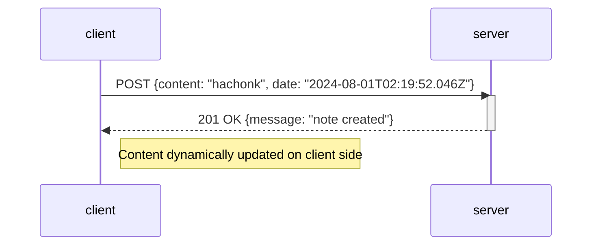

```mermaid
sequenceDiagram
  participant client
  participant server

  client->>server:POST {content: "hachonk", date: "2024-08-01T02:19:52.046Z"}
  activate server
  server-->>client:201 OK {message: "note created"}
  deactivate server

  Note right of client: Content dynamically updated on client side
```