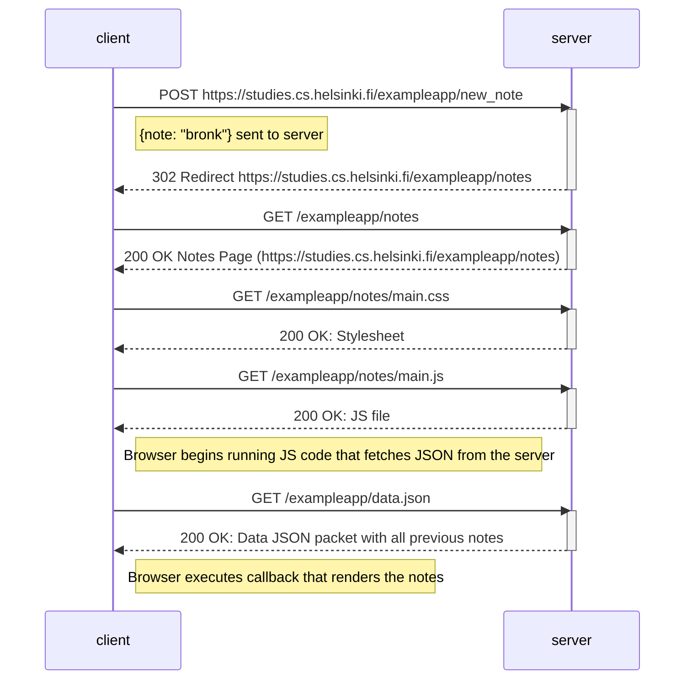

```mermaid
sequenceDiagram
  participant client
  participant server

  client->>server: POST https://studies.cs.helsinki.fi/exampleapp/new_note
  activate server
  Note right of client: {note: "bronk"} sent to server
  server-->>client: 302 Redirect https://studies.cs.helsinki.fi/exampleapp/notes
  deactivate server

  client->>server: GET /exampleapp/notes
  activate server
  server-->>client: 200 OK Notes Page (https://studies.cs.helsinki.fi/exampleapp/notes)
  deactivate server

  client->>server: GET /exampleapp/notes/main.css
  activate server
  server-->>client: 200 OK: Stylesheet
  deactivate server

  client->>server: GET /exampleapp/notes/main.js
  activate server
  server-->>client: 200 OK: JS file
  deactivate server

  Note right of client: Browser begins running JS code that fetches JSON from the server

  client->>server: GET /exampleapp/data.json
  activate server
  server-->>client: 200 OK: Data JSON packet with all previous notes
  deactivate server

  Note right of client: Browser executes callback that renders the notes

```